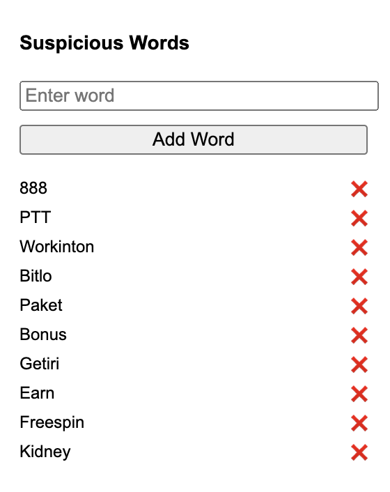

# Gmail Suspicious Keyword Alert Extension

A lightweight Chrome Extension that scans the **subject titles of emails in Gmail** for suspicious keywords defined by you. If a keyword is detected in an email title, the extension will **highlight the email in red** and **display an alert message**, helping you stay vigilant against phishing and suspicious emails.

---

## Features

- Automatically scans Gmail inbox for suspicious keywords.
- Highlights suspicious emails by changing color and bolding the title.
- Shows the matched keyword next to the email title.
- Customizable keyword list – add or remove suspicious words easily.
- Real-time updates – alerts refresh automatically when keywords are changed.

---

## How It Works

1. The extension reads the subject line (title) of each visible email in Gmail.
2. It compares them to a list of **user-defined suspicious words** stored in Chrome's local storage.
3. If a word is matched:
   - The email subject turns **red** and **bold**.
   - A red alert (`🔴 Suspicious: "word"`) is appended next to the subject.
4. You can manage the suspicious words using the simple interface popup.

---

## Installation Guide

1. Clone or download this repository.
2. Open Chrome and go to `chrome://extensions/`.
3. Enable **Developer mode** (top-right toggle).
4. Click **"Load unpacked"** and select the folder where you saved the extension.
5. Open Gmail and wait a few seconds – suspicious emails will be marked automatically!

---

## Screenshots

---

## Usage

- Click the extension icon in your Chrome toolbar.
- Enter a keyword (e.g., "urgent", "invoice", "password") and click **Add**.
- The keyword will be stored locally.
- Emails containing the keyword in the subject will be marked.
- To remove a keyword, click the ❌ icon next to it in the list.

---

## Technologies Used

- **JavaScript (Vanilla)**
- **Chrome Extension APIs**
- **DOM Manipulation**
- **Chrome Local Storage**

---

## Contributing

Feel free to submit pull requests or open issues for feature requests and bug reports!

---

## License

License
MIT License

---

🐼 Stay with Panda!

